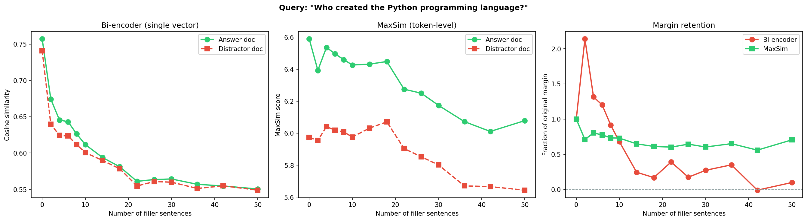
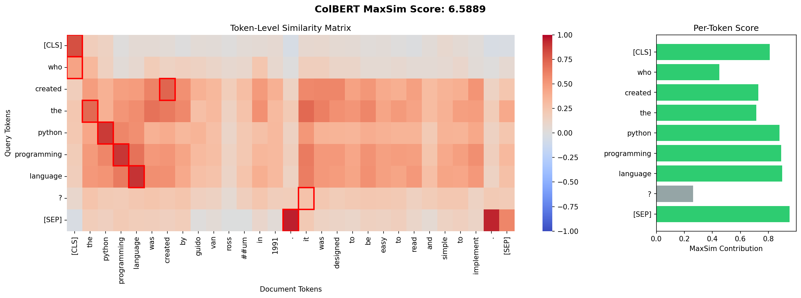
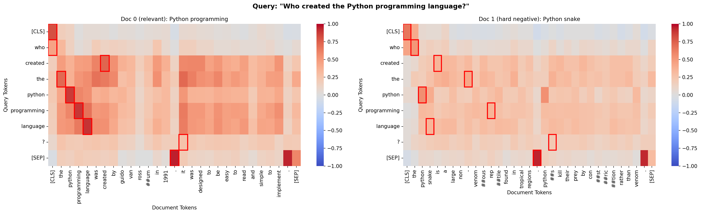
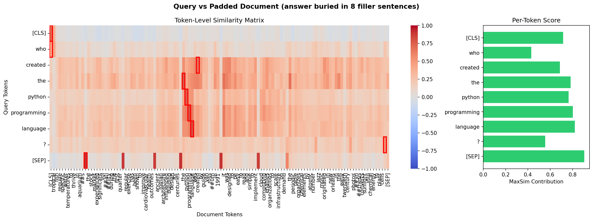

# Author's Note

When an analogy to the great work Gödel did, proving that certain systems are fundamentally insufficient, shows up in a new field, it's only natural to make a big deal about it. This time: DeepMind has proven a theoretical upper bound on bi-encoder capacity and shown how retrieval degrades as you approach the limit. Due to this, I have figured that going back to linear algebra is inevitable, and this repo will satisfy the condition that you read linear-algebra-based text once a week. This will be divided into 3 equally delightful pieces, in which we take on the titanic task of trying to make sense of common sense, forcing us to ask why something is better, not just that it is.

Just like the last time, thanks Claude for the docstrings and this beautiful and not-read-by-me README file. Without you, this would be unprofessional, and with you this is immoral.

# ColBERT from Scratch

A ground-up implementation of [ColBERT](https://arxiv.org/abs/2004.12832)'s late interaction retrieval model, built for understanding, not benchmarking.

This project takes ColBERT apart piece by piece. Every design choice is explained. Every tensor gets its shape printed. If you know what a dot product is, you can follow along.

> Most search systems compress an entire document into a single vector. That's like summarizing a 200-page book with a single word. Here's what happens when you don't.

---

## Status

**Parts 1 and 2 are released.** Part 3 is in progress.

| Part | Topic | Status |
|------|-------|--------|
| **1** | What MaxSim does and why it beats single-vector retrieval | **Released** |
| **2** | `[Q]`/`[D]` markers, projection, `[MASK]` augmentation, training, and what the model learns | **Released** |
| **3** | ColBERTv2 residual compression, PLAID, WARP | Planned |

Features that belong in Part 3 (not yet implemented):

- ColBERTv2 residual compression (k-means centroids, quantized residuals)
- PLAID / WARP retrieval engines
- Inverted file indexes for token-level retrieval
- Storage benchmarks vs full-size indexes
- ColPali, ColQwen, Jina-ColBERT-v2 extensions

---

## Quick Start

```bash
git clone https://github.com/YOUR_USERNAME/colbert-from-scratch.git
cd colbert-from-scratch

python -m venv venv
source venv/bin/activate  # Windows: venv\Scripts\activate

pip install -e ".[dev]"
```

Run the notebooks:

```bash
jupyter notebook notebooks/
```

Or open them directly in [Google Colab](https://colab.research.google.com/). Each notebook is self-contained and includes its own dependency installation.

Run the tests:

```bash
pytest tests/ -v
```

---

## Part 1: What MaxSim Does

### Notebook 01: MaxSim in Five Lines

The entire ColBERT scoring function, reduced to its essence:

```python
Q = np.random.randn(8, 128)       # 8 query tokens, 128 dims
D = np.random.randn(20, 128)      # 20 document tokens, 128 dims
similarity = Q @ D.T              # (8, 20) similarity matrix
max_per_query = similarity.max(axis=1)  # best match per query token
score = max_per_query.sum()        # final relevance score
```

No ML, no BERT, no frameworks. Just linear algebra. The notebook walks through each step, introduces L2 normalization (turning dot products into cosine similarities), and builds intuition for why token-level interaction matters.

### Notebook 02: The Information Bottleneck

Bi-encoders compress every document into a single vector. How far does that get you?

This notebook:
- Builds a toy bi-encoder using `bert-base-uncased` with mean pooling
- Builds token-level MaxSim retrieval with the same model
- Runs a dilution experiment: the same answer sentence, buried in increasing amounts of irrelevant filler, scored against a competitive distractor
- Shows how the bi-encoder's margin between the answer and distractor collapses as filler increases, while MaxSim's margin holds steady



The math is simple: mean pooling averages all tokens equally, so relevant tokens get diluted. MaxSim's max operator finds the best-matching token regardless of how many irrelevant tokens surround it. Same model, same embeddings, different architecture, different outcome.

### Notebook 03: Looking Inside MaxSim

The centerpiece visualization: a token-by-token cosine similarity matrix with MaxSim alignment overlaid.



- **Disambiguation through token-level voting.** "python" matches strongly in both the programming doc and the snake doc. But "programming", "language", and "created" only find matches in the relevant doc. Those tokens create the entire score gap.



- **Dilution immunity is visible.** The padded-document heatmap shows filler tokens as a sea of blue that MaxSim ignores. The red rectangles cluster on the answer sentence regardless of how much noise surrounds it.



MaxSim has zero trainable parameters. It's matrix multiplication + max + sum. All the intelligence lives in the embeddings.

---

## Part 2: The Design Choices, Training, and What the Model Learns

### Notebook 04: The Clever Bits

Three design choices separate ColBERT from "BERT + MaxSim":

1. **`[Q]` / `[D]` marker tokens.** `[unused0]` and `[unused1]` from BERT's vocabulary, prepended to queries and documents. Before training, they're inert. After training, they shift the representation space to separate query and document regions.

2. **768 to 128 projection.** A single `nn.Linear(768, 128, bias=False)` followed by L2 normalization. Drops 83% of dimensions. The original paper's ablation shows 128-dim loses ~1 point of MRR@10 compared to 768-dim, while cutting storage 6x.

3. **`[MASK]` query augmentation.** Every query is padded to 32 tokens with `[MASK]`. These pass through BERT's full self-attention stack and produce contextual embeddings. The original paper called this "query expansion." Later research (MacAvaney 2024, Yang 2024) showed they're actually reweighters, not expanders.

Each design choice is shown in isolation, then combined into a full forward pass over the toy dataset.

### Notebook 05: Training ColBERT

The training objective is simple: given (query, positive doc, negative doc), the positive should outscore the negative.

$$L = -\log \frac{\exp(S^+)}{\exp(S^+) + \exp(S^-)}$$

The notebook covers:
- Pairwise contrastive loss with a worked numerical example
- Hard negatives vs random negatives (and why hard negatives matter)
- In-batch negatives and the B x B score matrix
- The training loop: freeze most of BERT, train top 4 layers + projection with AdamW
- Before/after comparison on the toy dataset (rankings, score matrices, heatmaps)
- Gradient flow through MaxSim: the max operator creates sparse gradients, focusing learning on the best matches
- ColBERTv2 distillation loss (conceptual, with code)

### Notebook 06: What ColBERT Actually Learns

After training, the model exhibits behaviors that nobody explicitly taught it:

- **IDF weighting.** Rare tokens contribute more to the MaxSim score than common tokens. Naver Labs (ECIR 2021) measured r = -0.4 correlation between token contribution and corpus frequency. The model rediscovered IDF from relevance labels alone.

- **`[MASK]` tokens as reweighters.** t-SNE shows `[MASK]` embeddings clustering near real query tokens, not in novel regions. They amplify important terms rather than expanding the query into new concepts.

- **Stopword proxy matching.** After 12 layers of self-attention, function words like "of" and "did" absorb semantics from their neighbors. In "Where did the creator of Python work?", "did" matches "worked" in the relevant document. Important terms get multiple votes: once directly, and again through neighboring function words.

- **Spectral concentration.** High-IDF terms have stable embeddings across contexts (exact-match behavior). Low-IDF terms rotate based on context (proxy behavior). SVD of per-term embeddings quantifies this.

The conclusion: ColBERT is a neural BM25. The sum-of-maxes structure mirrors BM25's sum-of-weighted-term-scores, and training fills in the weights that BM25 computes from corpus statistics.

---

## Project Structure

```
colbert-from-scratch/
├── README.md
├── pyproject.toml
├── requirements.txt
│
├── notebooks/
│   ├── 01_maxsim_in_five_lines.ipynb
│   ├── 02_bow_vs_embeddings.ipynb
│   ├── 03_the_heatmap.ipynb
│   ├── 04_the_clever_bits.ipynb
│   ├── 05_training_colbert.ipynb
│   └── 06_what_colbert_learns.ipynb
│
├── colbert_from_scratch/       <- Part 1 library (MaxSim + viz)
│   ├── __init__.py
│   ├── maxsim.py               <- MaxSim scoring (NumPy + PyTorch)
│   └── viz.py                  <- heatmap and bar chart utilities
│
├── part2/                      <- Part 2 library
│   ├── __init__.py
│   ├── tokenize.py             <- query/doc tokenization with [Q]/[D]/[MASK]
│   ├── encoder.py              <- ColBERTEncoder: BERT + projection + L2 norm
│   ├── model.py                <- ColBERT model class
│   ├── training.py             <- loss functions and training loop
│   └── analysis.py             <- IDF, token contributions, spectral tools
│
├── data/
│   └── toy_retrieval.json      <- 10-document dataset with 5 queries
│
├── figures/                    <- exported PNGs (generated by notebooks)
│
└── tests/
    └── test_data.py
```

---

## The Libraries

### colbert_from_scratch (Part 1)

`maxsim_np(Q, D, normalize=True)` - NumPy MaxSim. `Q` is `(N_q, d)`, `D` is `(N_d, d)`. Returns a float.

`maxsim_torch(Q, D, normalize=True)` - PyTorch MaxSim. Same interface. Returns a scalar tensor.

`plot_maxsim_heatmap(Q_embeddings, D_embeddings, query_tokens, doc_tokens)` - Two-panel figure: similarity heatmap with MaxSim overlay + per-token score bar chart. Returns a `matplotlib.figure.Figure`.

### part2

`tokenize_query(text, tokenizer, max_length=32)` - Tokenizes with `[Q]` marker and `[MASK]` padding.

`tokenize_document(text, tokenizer, max_length=180)` - Tokenizes with `[D]` marker.

`ColBERTEncoder(bert_model, dim=128)` - BERT + `nn.Linear(768, 128, bias=False)` + L2 norm.

`ColBERT(bert_model, tokenizer, dim=128)` - Full model with query/document encoding and doc filtering.

`colbert_pairwise_loss(query_emb, pos_doc_emb, neg_doc_emb)` - Cross-entropy over positive vs negative MaxSim scores.

`compute_idf(documents, tokenizer)` - Corpus IDF values. `token_contributions(query_emb, doc_emb, query_tokens)` - Per-token MaxSim decomposition.

---

## The Dataset

`data/toy_retrieval.json` contains 10 documents and 5 queries designed to expose specific retrieval phenomena:

| Query | Tests | Bi-encoder struggles? |
|-------|-------|-----------------------|
| q0: "Who created the Python programming language?" | Disambiguation (python language vs. snake) | Yes |
| q1: "What is the longest snake species?" | Ranking among multiple snake documents | Sometimes |
| q2: "Where did the creator of Python work?" | Multi-hop reasoning (creator -> van Rossum -> Google) | Yes |
| q3: "What do machine learning models need?" | Control case | No |
| q4: "Which programming languages are most popular?" | Ranking when multiple docs mention programming | Sometimes |

Each query includes `relevant` document IDs and `hard_negative` IDs.

---

## Models

Part 1 uses `bert-base-uncased` (110M parameters) with raw token embeddings. No fine-tuning, no projection.

Part 2 adds a 768-to-128 projection layer and trains the top 4 BERT layers on the toy dataset. All inference runs under `torch.no_grad()`. Training uses MPS (Apple Silicon) or CPU.

---

## Dependencies

| Package | Purpose |
|---------|---------|
| `numpy` | Core array operations |
| `matplotlib` | Plotting |
| `seaborn` | Heatmap rendering |
| `torch` | PyTorch MaxSim + training |
| `transformers` | BERT tokenizer and model |
| `sentence-transformers` | Optional, cleaner bi-encoder baseline |
| `scikit-learn` | t-SNE for notebook 06 |

All pinned to minor versions. See `requirements.txt` for exact ranges.

---

## References

- Khattab & Zaharia, [ColBERT: Efficient and Effective Passage Search via Contextualized Late Interaction over BERT](https://arxiv.org/abs/2004.12832) (SIGIR 2020)
- Formal et al., [A White Box Analysis of ColBERT](https://arxiv.org/abs/2106.00284) (ECIR 2021, Best Short Paper)
- Santhanam et al., [ColBERTv2: Effective and Efficient Retrieval via Lightweight Late Interaction](https://arxiv.org/abs/2112.01488) (NAACL 2022)
- MacAvaney et al., [Beneath the [MASK]: An Analysis of Structural Query Tokens in ColBERT](https://arxiv.org/abs/2404.08478) (ECIR 2024)
- Weller et al., [On the Theoretical Limitations of Embedding-Based Retrieval](https://arxiv.org/abs/2412.04616) (Google DeepMind, 2025)

---

## License

MIT
